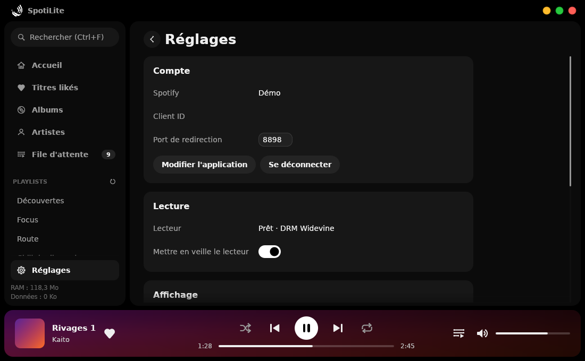

# SpotiLite

Client Spotify **Premium** natif pour Windows, pensé pour consommer le moins possible :
un seul exécutable, une interface dessinée sans carte graphique, et le lecteur officiel de
Spotify pour le son.


SpotiLite n'est pas une version web de Spotify : l'interface est dessinée par l'application
elle-même (Rust + [egui](https://github.com/emilk/egui)), **par le processeur**, dans une simple
fenêtre Windows : aucun moteur web pour l'interface, aucun pilote graphique chargé. Le son vient du
**lecteur officiel de Spotify** ([Web Playback SDK](https://developer.spotify.com/documentation/web-playback-sdk)),
exécuté de façon invisible dans WebView2, le moteur Edge intégré à Windows, et déchiffré par le DRM
d'Edge comme dans un navigateur.

## Points forts

| | |
|---|---|
| **Léger** | Un seul `.exe` sans DLL à installer. Interface rendue par le processeur : pas de pilote OpenGL/Direct3D en mémoire. Le lecteur ne démarre qu'à la première lecture et se met en veille après une pause (10 min par défaut) pour rendre sa mémoire. |
| **Lecture officielle** | Le son passe par le lecteur de Spotify lui-même : tous les titres de votre abonnement Premium, sans les refus de clés que subissent les lecteurs libres. |
| **Économe en données** | Réponses de l'API compressées (gzip), bibliothèque mise en cache et resynchronisée seulement quand elle change, pochettes minuscules (64 px) et désactivables. |
| **Sobre et arrondi** | Fenêtre **noire AMOLED** (pixels éteints sur les écrans OLED), surfaces arrondies presque noires, **blanc comme seul accent**, icônes vectorielles dessinées par le code. |
| **Votre propre quota** | Bibliothèque, recherche et lecture passent par **votre application Spotify** (créée en 2 minutes, guide intégré) : pas d'erreurs « limite de requêtes » dues à un jeton partagé. |
| **Intégré à Windows** | Touches multimédia, panneau média de Windows (volume, écran de verrouillage), barre de titre sombre, pas de fenêtre console. |

## Fonctionnalités

- Titres likés, albums sauvegardés, playlists, pages album et artiste, recherche (titres,
  artistes, albums, playlists).
- Lecture, pause, position, volume, aléatoire, répétition (tout / un titre), file d'attente
  (« Ajouter à la file » au clic droit).
- J'aime / je n'aime plus, liens vers l'album et l'artiste, copie du lien d'un titre.
- Filtre instantané dans une liste (sans requête réseau), listes virtualisées (10 000 titres
  s'affichent aussi vite que 20).
- Playlists d'autres utilisateurs et artistes : Spotify ne donne pas leur contenu aux applications
  en mode développement, SpotiLite les fait donc **lire telles quelles par Spotify** (les titres
  s'affichent au fil de la lecture, la file d'attente montre les suivants).
- Mode hors ligne partiel : ce qui a déjà été chargé reste consultable depuis le cache.
- RAM de SpotiLite et du lecteur, et données reçues, affichées en bas de la barre latérale.

## Mémoire

| Partie | Ce qui la réduit |
|---|---|
| SpotiLite (interface) | Rendu par le processeur dans un tampon de pixels : aucun pilote graphique chargé (c'est souvent le plus gros poste d'une petite application). Polices du système projetées en mémoire au lieu d'être copiées. Un seul fil réseau. Au plus 48 vignettes de 128 px et 12 pages gardées en mémoire. Mémoire rendue à Windows quand la fenêtre est réduite. |
| Lecteur (processus WebView2) | Ne démarre qu'à la première lecture. Profil allégé : pas de processus GPU, un seul processus de rendu, sortie audio dans le processus principal, petit cache disque, objectif mémoire « bas » de WebView2. Mis **en veille** après une pause (5, 10 ou 30 min, ou jamais) : ses processus se ferment et rendent toute leur mémoire. Si le profil allégé ne fonctionne pas sur un PC, SpotiLite passe tout seul en mode compatible. |

Mesures sous Windows (intégration continue, Windows Server 2025) : **SpotiLite 6,7 Mo** à
l'ouverture (ensemble de travail privé, la valeur du Gestionnaire des tâches ; un peu plus une fois
la bibliothèque et les pochettes affichées), **lecteur 121 Mo** en profil allégé (131 Mo en mode
compatible) pendant qu'il tourne, **0 Mo** une fois en veille.

Les deux valeurs sont visibles en permanence en bas à gauche (« RAM … + lecteur … »), et en détail
dans *Réglages → Mémoire*.

## Installation

1. Téléchargez `SpotiLite-windows-x64.zip` depuis les *Releases* du dépôt (ou l'artefact
   **SpotiLite-windows-x64** de la dernière exécution de l'action *Build*).
2. Décompressez et lancez `SpotiLite.exe`. Rien d'autre à installer : WebView2 est présent sur
   Windows 11 et Windows 10 à jour (sinon : [installation](https://go.microsoft.com/fwlink/p/?LinkId=2124703)).

Si Windows SmartScreen affiche un avertissement (exécutable non signé) : *Informations
complémentaires* → *Exécuter quand même*.

### Première connexion : votre application Spotify

SpotiLite affiche un mini-guide, à suivre une seule fois :


1. Ouvrez le [tableau de bord Spotify](https://developer.spotify.com/dashboard) et cliquez sur
   **Create app** (gratuit ; Spotify exige un compte Premium, ce que vous avez déjà).
2. Nom et description : au choix, par exemple « SpotiLite ».
3. Dans **Redirect URIs**, ajoutez exactement `http://127.0.0.1:8898/login` (bouton *Copier* dans
   l'app) puis **Add**.
4. Cochez **Web API** et **Web Playback SDK**, acceptez les conditions, **Save**.
5. Dans **Settings**, copiez le **Client ID** et le **Client Secret** (*View client secret*),
   collez-les dans SpotiLite puis cliquez sur **Connecter** et acceptez dans le navigateur.

C'est la seule connexion : aucun mot de passe ne transite par SpotiLite (la page de connexion est
celle de Spotify). Si vous écoutez avec un autre compte Spotify que celui du tableau de bord,
ajoutez-le dans **User Management**. Le Client Secret est facultatif (sans lui, SpotiLite utilise
PKCE).

**Vous veniez de la version 0.1 ?** Votre application est reprise ; Spotify demande une fois une
autorisation supplémentaire pour la lecture (le navigateur s'ouvre, ou *Réglages → Application
Spotify → Autoriser la lecture*). Pensez à cocher **Web Playback SDK** dans votre application.
L'ancien cache audio (jusqu'à 4 Go) est supprimé au premier lancement.

**Sécurité** : le Client Secret et le jeton d'accès sont chiffrés par Windows (DPAPI) : seule
votre session Windows, sur ce PC, peut les lire. Ils ne sont envoyés qu'à Spotify.

## Comment se passe la lecture



- SpotiLite garde sa propre file d'attente (ordre, aléatoire, répétition, ajouts) et demande à
  Spotify de jouer chaque titre sur son lecteur (`PUT /me/player/play`, une requête par titre).
- Le lecteur apparaît comme appareil « SpotiLite » dans vos autres applications Spotify ; si la
  lecture passe sur un autre appareil, SpotiLite se met en pause et reprend au même endroit.
- Le débit audio est choisi par Spotify (AAC, en général 128 à 256 kbit/s) ; les données reçues
  par le lecteur sont comptées.
- Diagnostic : *Réglages → Lecture* indique l'état du lecteur et le DRM utilisé ;
  `SPOTILITE_WEBVIEW_DEBUG=1` affiche sa fenêtre et ses outils de développement ; le journal est
  dans `%LOCALAPPDATA%\SpotiLite\spotilite.log`.

## Raccourcis clavier

| Touche | Action |
|---|---|
| `Espace` | Lecture / pause |
| `Ctrl` + `→` / `←` | Titre suivant / précédent |
| `Ctrl` + `↑` / `↓` | Volume |
| `Ctrl` + `F` | Rechercher |
| `Ctrl` + `L` | J'aime le titre en cours |
| `Alt` + `←` ou bouton « précédent » de la souris | Retour |
| `↑` / `↓` puis `Entrée` | Parcourir une liste et lancer un titre |
| Double-clic sur un titre | Lecture |
| Clic droit sur un titre | Ajouter à la file, aller à l'album / à l'artiste, j'aime, copier le lien |
| Touches multimédia | Lecture, pause, suivant, précédent |

## Fichiers

- Réglages et identifiants de l'application (chiffrés) : `%APPDATA%\SpotiLite`
- Caches (bibliothèque, pochettes, profil du lecteur) et journal : `%LOCALAPPDATA%\SpotiLite`
- **Mode portable** : créez un dossier `spotilite-data` à côté de `SpotiLite.exe` ; tout y sera
  enregistré.
- *Réglages → Se déconnecter* efface l'autorisation et la bibliothèque en cache (l'application
  reste enregistrée, pour se reconnecter en un clic).

## Limites connues

- Pas de podcasts ni de paroles.
- Les playlists dont vous n'êtes ni propriétaire ni collaborateur, et les titres populaires des
  artistes, ne sont pas lisibles par une application en mode développement : SpotiLite les fait
  jouer en entier par Spotify (sans liste de titres préalable).
- Un petit blanc (moins d'une seconde) peut s'entendre entre deux titres de la file de SpotiLite.
- SpotiLite est un client **non officiel**, sans lien avec Spotify AB ; il utilise le lecteur web
  officiel de Spotify et l'API Web publique, que Spotify peut modifier à tout moment.

## Compiler

Prérequis : [Rust](https://rustup.rs) stable ≥ 1.95 et, sous Windows, les *Build Tools* de
Visual Studio (le SDK Windows fournit `rc.exe` pour l'icône).

```powershell
cargo build --release
# => target\release\spotilite.exe
```

Tests : `cargo test`. Sous Windows, `cargo test -- --ignored --nocapture` lance aussi un test réel
du lecteur (WebView2 + lecteur de Spotify, réseau nécessaire) et mesure la mémoire de ses deux
profils. En build de debug, `SPOTILITE_DEMO=1` affiche l'interface avec des données fictives ;
ajoutez `SPOTILITE_DEMO_SETUP=1` pour l'écran de configuration ou `SPOTILITE_DEMO_VIEW=settings`
/ `queue`. L'interface tourne aussi sous Linux (X11) pour le développement ; la lecture n'existe
que sous Windows.

### Architecture

```
src/
├── main.rs          démarrage, icône dessinée par le code
├── window.rs        fenêtre winit + egui, rendu par le processeur (softbuffer)
├── ui/              interface egui (thème, écrans, widgets et icônes vectorielles)
├── backend/         fil réseau (Tokio, un seul fil)
│   ├── mod.rs       commandes, file de lecture, cache de bibliothèque
│   ├── engine/      lecteur : WebView2 invisible + Web Playback SDK de Spotify
│   ├── auth.rs      OAuth 2.0 dans le navigateur (Client Secret ou PKCE)
│   ├── webapi.rs    client minimal de l'API Web (gzip, pagination, reprise sur 429)
│   ├── vault.rs     secrets chiffrés avec DPAPI sous Windows
│   └── store.rs     cache disque (JSON et vignettes)
├── queue.rs         file de lecture locale (aléatoire, répétition, ajouts)
├── media.rs         touches multimédia et panneau média de Windows
└── sys.rs           mesure et libération de la mémoire
vendor/egui_software_backend/   rastériseur egui sur processeur (MIT/Apache-2.0), porté à egui 0.36
```

L'interface envoie des commandes au backend et reçoit des événements par des canaux ; le
backend réveille l'interface seulement quand il a quelque chose à afficher.

## Licence

MIT. Le rastériseur `vendor/egui_software_backend` est sous licence MIT ou Apache-2.0 (voir ses
fichiers de licence). SpotiLite n'est ni affilié à Spotify ni approuvé par Spotify. « Spotify » est
une marque de Spotify AB.
