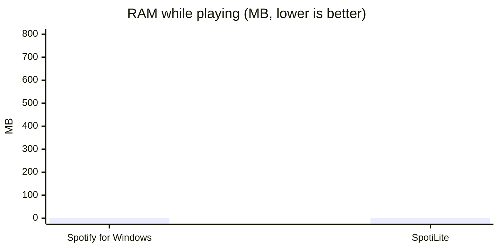
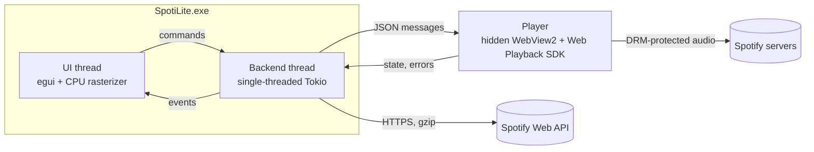

<div align="center">


# SpotiLite

**A lightweight native Spotify client for Windows, written in Rust.**

[](https://github.com/Clemslegoat/SpotiLite/actions/workflows/build.yml)
[](https://github.com/Clemslegoat/SpotiLite/releases/latest)
[](#requirements)
[](https://www.rust-lang.org)
[](LICENSE)

</div>

> [!IMPORTANT]
> **A Spotify Premium account is required.** Playback goes through Spotify's official Web Playback
> SDK, which only works with Premium accounts. A free account can browse its library but cannot
> play anything.


SpotiLite is a single, self-contained `.exe` that replaces the Spotify desktop app for everyday
listening. The interface is drawn by the CPU into a plain window buffer: no Electron, no Chromium
for the UI, no GPU driver loaded. Audio is played by Spotify's own player, hosted in an invisible
WebView2 instance, so every track of a Premium subscription plays exactly as it does in the
official apps.

## Memory usage

<!-- Measurements to come: replace the zeros (RAM in MB while playing, Task Manager). -->



## Features

- **Library**: liked songs, saved albums, followed artists, playlists, search, artist pages with
  your liked tracks and discography.
- **Home page** with shortcuts and recently played tracks.
- **Playback**: play/pause, seek, volume, shuffle, repeat (all / one), local play queue (add,
  remove), add to / remove from your playlists, like / unlike.
- **Look**: AMOLED black theme with a white accent, rounded panels, cover-colored headers and
  player bar, hand-drawn vector icons, custom title bar.
- **Windows integration**: media keys, headset buttons, Windows media flyout and lock screen
  (System Media Transport Controls), Windows 11 rounded corners and snapping.
- **Data saving**: gzip API responses, library cached on disk and only re-downloaded when it
  changes (playlist snapshots), small covers that can be turned off.
- **Privacy**: no account password ever goes through SpotiLite (OAuth in the browser), credentials
  encrypted with Windows DPAPI, no telemetry.
- **Portable mode**: create a `spotilite-data` folder next to the executable.

The interface is in French.

## Requirements

- Spotify **Premium**.
- Windows 10 or 11, 64-bit, with [WebView2](https://go.microsoft.com/fwlink/p/?LinkId=2124703)
  (preinstalled on Windows 11 and up-to-date Windows 10).
- A free Spotify developer app (created once, in two minutes, see below).

## Installation

1. Download **`SpotiLite.exe`** from the [latest release](https://github.com/Clemslegoat/SpotiLite/releases/latest).
2. Run it. No installer, no administrator rights.

The executable is not code-signed: if SmartScreen warns, choose *More info* → *Run anyway*.

### First launch

Spotify only lets third-party clients in through a developer app created by the user. SpotiLite
shows a step-by-step guide:

1. Open the [Spotify developer dashboard](https://developer.spotify.com/dashboard) and click
   **Create app**.
2. Add the redirect URI `http://127.0.0.1:8898/login`.
3. Tick **Web API** and **Web Playback SDK**, then save.
4. Paste the **Client ID** and **Client Secret** into SpotiLite and accept the authorization in
   the browser.

A development-mode app accepts up to 5 Spotify accounts, added under *User Management*. Using your
own app also means your own API quota, shared with nobody.

## Keyboard shortcuts

| Key | Action |
|---|---|
| `Space` | Play / pause |
| `Ctrl` + `→` / `←` | Next / previous track |
| `Ctrl` + `↑` / `↓` | Volume |
| `Ctrl` + `F` | Search |
| `Ctrl` + `L` | Like the current track |
| `Alt` + `←`, mouse back button | Back |
| `↑` / `↓`, `Enter` | Move in a list, play |
| Right click on a track | Queue, add to / remove from a playlist, album, artist, like, copy link |

## How it works



- **UI**: [egui](https://github.com/emilk/egui) on [winit](https://github.com/rust-windowing/winit),
  rasterized on the CPU ([egui_software_backend](vendor/egui_software_backend), vendored and ported
  to egui 0.36) into a [softbuffer](https://github.com/rust-windowing/softbuffer) surface. Frames
  are only drawn on input, backend events, or once per second while music plays.
- **Backend**: one Tokio thread owns the Web API client, the disk cache and the play queue. It
  talks to the UI through channels and wakes it only when something changes.
- **Playback**: the [Web Playback SDK](https://developer.spotify.com/documentation/web-playback-sdk)
  runs in a hidden WebView2 window and registers a Spotify Connect device. SpotiLite keeps its own
  queue and starts each track with `PUT /me/player/play`; playlists Spotify does not expose to
  development-mode apps are played as a whole context. Decryption uses Edge's DRM (Widevine or
  PlayReady), like a browser.
- **Auth**: OAuth 2.0 authorization code flow (client secret or PKCE) through a one-shot local
  redirect server; tokens and secret are stored with DPAPI.

### Keeping memory low

| Part | What keeps it small |
|---|---|
| Interface | No GPU driver or WebView for the UI; system fonts memory-mapped instead of copied; a single network thread; at most 48 covers (128 px) and 12 pages kept in memory; working set trimmed when the window is minimized. |
| Player | Started on first playback. Lean WebView2 profile (no GPU process, one renderer process, in-process audio, low memory target) with automatic fallback to defaults. Put to sleep after 5 minutes of pause (optional), giving all its memory back. |

## Building from source

Requires [Rust](https://rustup.rs) 1.95+ and, on Windows, the Visual Studio Build Tools.

```powershell
git clone https://github.com/Clemslegoat/SpotiLite
cd SpotiLite
cargo build --release   # target\release\spotilite.exe
```

```powershell
cargo test                             # unit tests
cargo test -- --ignored --nocapture    # Windows: real WebView2 + SDK start-up, memory of both profiles
```

Debug builds have a demo mode with fake data: `SPOTILITE_DEMO=1`, plus `SPOTILITE_DEMO_VIEW=home`,
`settings`, `queue`, `artists`, `artist` or `playlist`, `SPOTILITE_DEMO_SETUP=1` for the setup
screen, `SPOTILITE_DEMO_ICONS=1` for the icon sheet. The interface also runs on Linux (X11) for
development; playback is Windows-only. `SPOTILITE_WEBVIEW_DEBUG=1` shows the player window and its
developer tools.

<details>
<summary>Project layout</summary>

```
src/
├── main.rs          entry point
├── window.rs        borderless winit window, egui frame loop, CPU rendering (softbuffer)
├── logo.rs          embedded logo mask, window icon
├── ui/              interface: theme, pages, title bar, widgets, vector icons, cover gradients
├── backend/
│   ├── mod.rs       commands and events, play queue, library cache, player lifecycle
│   ├── engine/      WebView2 host and the page running the Web Playback SDK
│   ├── auth.rs      OAuth 2.0 (client secret or PKCE)
│   ├── webapi.rs    minimal Web API client (gzip, pagination, 429 retry)
│   ├── vault.rs     DPAPI-encrypted secrets
│   └── store.rs     disk cache (JSON, covers)
├── queue.rs         local queue: order, shuffle, repeat, additions
├── media.rs         System Media Transport Controls (media keys, Windows flyout)
└── sys.rs           memory measurement and trimming
vendor/egui_software_backend/   CPU rasterizer for egui (MIT/Apache-2.0)
```

</details>

## Files

| What | Where |
|---|---|
| Settings, encrypted credentials, recently played | `%APPDATA%\SpotiLite` |
| Cache (library, covers, player profile) and log | `%LOCALAPPDATA%\SpotiLite` |
| Portable mode | `spotilite-data\` next to `SpotiLite.exe` |

## Limitations

- Windows only; no podcasts or lyrics.
- Since February 2026, Spotify gives development-mode apps neither the content of other users'
  playlists nor artists' top tracks: such playlists are played as a whole by Spotify, and artist
  pages show your liked tracks and the discography instead.
- A short gap can be heard between two tracks of SpotiLite's own queue.
- Audio quality is the web player's: AAC 256 kbit/s for Premium, chosen by Spotify.

## License

[MIT](LICENSE). The vendored rasterizer in `vendor/egui_software_backend` is MIT or Apache-2.0.

SpotiLite is an unofficial client, not affiliated with or endorsed by Spotify AB. "Spotify" is a
trademark of Spotify AB.
