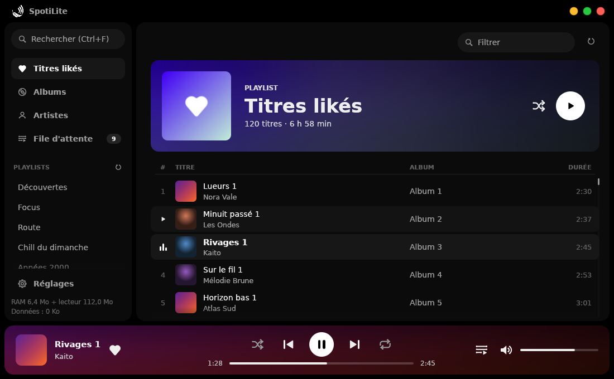
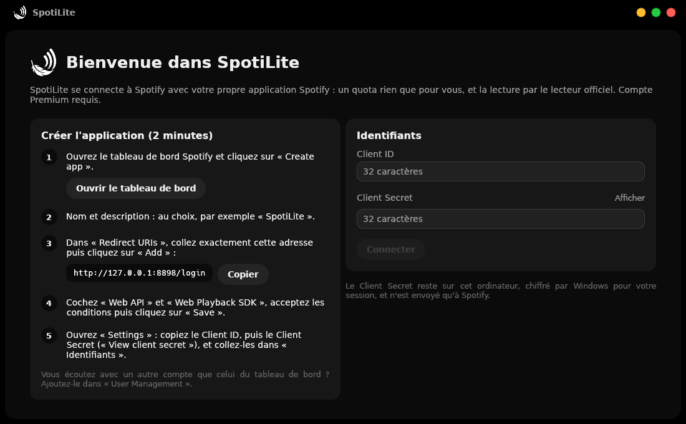

# SpotiLite

**Écoutez Spotify sur Windows avec une application légère, sobre et rapide.**

> ⚠️ **Réservé aux abonnés Spotify Premium.** SpotiLite utilise le lecteur officiel de Spotify,
> qui ne fonctionne qu'avec un compte Premium. Un compte gratuit ne pourra pas lire de musique.



SpotiLite remplace l'application Spotify de bureau quand vous voulez simplement écouter votre
musique sans qu'elle occupe la moitié de la mémoire de votre PC : environ **250 Mo au total au lieu
de 700 Mo** pour l'application officielle, mesuré sur le même PC.

- **Léger** : un seul fichier `.exe`, rien à installer. L'interface tient en quelques mégaoctets.
- **Toute votre bibliothèque** : titres likés, albums, artistes suivis, playlists, recherche,
  file d'attente, aléatoire, répétition.
- **Le vrai son de Spotify** : la musique est lue par le lecteur officiel de Spotify, en qualité
  Premium.
- **Sobre** : fond noir profond (idéal sur écran OLED), coins arrondis, en-têtes et barre de
  lecture aux couleurs de la pochette, barre de titre maison avec boutons aux couleurs de macOS.
- **Économe en données** : bibliothèque gardée en cache, petites pochettes (désactivables).
- **Intégré à Windows** : touches multimédia du clavier, panneau média de Windows, écran de
  verrouillage.

## Ce qu'il vous faut

- Un compte **Spotify Premium**.
- Windows 10 ou 11 (64 bits). WebView2, le moteur d'Edge, est déjà présent sur Windows 11 et
  Windows 10 à jour (sinon : [le télécharger](https://go.microsoft.com/fwlink/p/?LinkId=2124703)).

## Installation

1. Allez dans les [**Releases**](https://github.com/Clemslegoat/SpotiLite/releases/latest) et
   téléchargez **`SpotiLite.exe`**.
2. Lancez-le. C'est tout : pas d'installation, pas de droits administrateur.

Si Windows affiche « Windows a protégé votre ordinateur » : cliquez sur *Informations
complémentaires* puis *Exécuter quand même*. Cet avertissement apparaît pour toutes les
applications qui ne sont pas signées par un certificat payant.

## Premier lancement : 2 minutes, une seule fois

Spotify demande que chaque application tierce passe par une « application développeur » créée
avec votre compte. C'est gratuit et SpotiLite vous guide pas à pas :



1. Ouvrez le [tableau de bord Spotify](https://developer.spotify.com/dashboard), connectez-vous et
   cliquez sur **Create app**.
2. Donnez-lui un nom et une description au choix (par exemple « SpotiLite »).
3. Dans **Redirect URIs**, collez `http://127.0.0.1:8898/login` (bouton *Copier* dans SpotiLite)
   puis cliquez sur **Add**.
4. Cochez **Web API** et **Web Playback SDK**, acceptez les conditions et cliquez sur **Save**.
5. Ouvrez **Settings**, copiez le **Client ID** et le **Client Secret** (*View client secret*),
   collez-les dans SpotiLite, cliquez sur **Connecter** et acceptez dans le navigateur.

Votre mot de passe Spotify n'est jamais saisi dans SpotiLite : la connexion se fait sur la page
officielle de Spotify. Le Client Secret et la connexion sont chiffrés par Windows et ne quittent
votre PC que pour aller chez Spotify.

## Utilisation

- **Menu de gauche** : recherche, titres likés, albums, artistes, file d'attente, playlists et
  réglages.
- **Double-clic** sur un titre pour le lire, **clic droit** pour l'ajouter à la file, aller à
  l'album ou à l'artiste, l'aimer ou copier son lien.
- **Barre du bas** : aléatoire, précédent, lecture/pause, suivant, répétition, position, file
  d'attente et volume.
- SpotiLite apparaît comme appareil « SpotiLite » dans vos autres applications Spotify (téléphone,
  enceintes…).

### Raccourcis clavier

| Touche | Action |
|---|---|
| `Espace` | Lecture / pause |
| `Ctrl` + `→` / `←` | Titre suivant / précédent |
| `Ctrl` + `↑` / `↓` | Volume |
| `Ctrl` + `F` | Rechercher |
| `Ctrl` + `L` | Aimer le titre en cours |
| `Alt` + `←` ou bouton « précédent » de la souris | Retour |
| `↑` / `↓` puis `Entrée` | Parcourir une liste et lancer un titre |
| Touches multimédia | Lecture, pause, suivant, précédent |

## Questions fréquentes

**Est-ce gratuit ?** Oui, SpotiLite est gratuit et open source. Il faut en revanche un abonnement
Spotify Premium.

**Ça marche avec un compte gratuit ?** Non. Le lecteur officiel de Spotify qu'utilise SpotiLite
n'est disponible que pour les comptes Premium.

**Quelle est la qualité du son ?** Celle du lecteur web de Spotify en Premium : AAC à 256 kbit/s,
choisie par Spotify. Il n'y a pas de réglage de qualité ni de son sans perte (lossless).

**Pourquoi créer une « application » sur le site de Spotify ?** Spotify n'autorise les
applications tierces qu'avec un identifiant créé par un compte. Avoir le vôtre vous évite de
partager les limites de requêtes avec d'autres utilisateurs.

**J'écoute avec un autre compte que celui qui a créé l'application.** Ajoutez ce compte dans
**User Management** sur la page de votre application Spotify.

**Certaines playlists ne montrent pas leurs titres.** Spotify ne donne pas le contenu des
playlists des autres utilisateurs aux applications personnelles. SpotiLite les fait alors lire
directement par Spotify : les titres s'affichent au fil de la lecture et la file d'attente montre
les suivants.

**Pourquoi la page d'un artiste n'a pas ses « titres populaires » ?** Spotify ne les donne plus
aux applications personnelles. La page montre à la place vos titres likés de cet artiste et sa
discographie, et le bouton ▶ fait jouer ses titres populaires par Spotify. La page *Artistes*
montre les artistes que vous suivez et ceux qui reviennent le plus dans vos titres likés.

**Spotify me redemande une autorisation.** Une nouvelle version peut avoir besoin d'une
permission en plus (par exemple pour les artistes suivis) : cliquez sur *Réglages → Compte →
Autoriser* et acceptez dans le navigateur.

**Comment réduire encore la mémoire ?** Le lecteur se met en veille après une pause (10 minutes
par défaut, réglable dans *Réglages → Lecture*) et SpotiLite rend sa mémoire à Windows quand la
fenêtre est réduite. La mémoire utilisée est affichée en bas du menu.

**Où sont mes données ? Comment tout effacer ?** Les réglages sont dans `%APPDATA%\SpotiLite`, le
cache et le journal dans `%LOCALAPPDATA%\SpotiLite`. *Réglages → Se déconnecter* efface la
connexion et la bibliothèque en cache ; supprimer ces deux dossiers efface tout.

**Peut-on l'utiliser depuis une clé USB ?** Oui : créez un dossier `spotilite-data` à côté de
`SpotiLite.exe`, tout y sera enregistré.

**Un problème ?** Ouvrez une [issue](https://github.com/Clemslegoat/SpotiLite/issues) en joignant
si possible le journal `%LOCALAPPDATA%\SpotiLite\spotilite.log`.

## Limites

- Pas de podcasts ni de paroles.
- Un très court blanc peut s'entendre entre deux titres de la file de SpotiLite.
- Windows uniquement.
- SpotiLite est un client **non officiel**, sans lien avec Spotify. Il repose sur le lecteur web
  et l'API publique de Spotify, que Spotify peut modifier à tout moment.

---

## Pour les développeurs

### Comment ça marche

L'interface est dessinée par l'application elle-même (Rust + [egui](https://github.com/emilk/egui)),
**par le processeur**, dans une simple fenêtre Windows : aucun moteur web pour l'interface, aucun
pilote graphique chargé. Le son vient du lecteur officiel de Spotify
([Web Playback SDK](https://developer.spotify.com/documentation/web-playback-sdk)), exécuté de façon
invisible dans WebView2 et déchiffré par le DRM d'Edge comme dans un navigateur. SpotiLite garde sa
propre file d'attente et demande à Spotify de jouer chaque titre sur ce lecteur
(`PUT /me/player/play`).

Mesures sous Windows (intégration continue) : **interface 6,7 Mo** à l'ouverture (ensemble de
travail privé), **lecteur 121 Mo** en profil allégé pendant la lecture, **0 Mo** en veille.

| Partie | Ce qui réduit la mémoire |
|---|---|
| Interface | Rendu par le processeur (pas de pilote OpenGL/Direct3D), polices du système projetées en mémoire, un seul fil réseau, au plus 48 vignettes de 128 px et 12 pages en mémoire, mémoire rendue quand la fenêtre est réduite. |
| Lecteur (WebView2) | Démarre à la première lecture ; profil allégé (pas de processus GPU, un seul processus de rendu, objectif mémoire « bas ») avec repli automatique en mode compatible ; mis en veille après une pause. |

### Compiler

Prérequis : [Rust](https://rustup.rs) stable ≥ 1.95 et, sous Windows, les *Build Tools* de
Visual Studio.

```powershell
cargo build --release
# => target\release\spotilite.exe
```

Tests : `cargo test`. Sous Windows, `cargo test -- --ignored --nocapture` lance aussi un test réel
du lecteur (réseau nécessaire). En build de debug, `SPOTILITE_DEMO=1` affiche l'interface avec des
données fictives (`SPOTILITE_DEMO_SETUP=1` pour l'écran de configuration,
`SPOTILITE_DEMO_VIEW=settings` / `queue` / `artists` pour une page). L'interface tourne aussi sous
Linux (X11) pour le développement ; la lecture n'existe que sous Windows.
`SPOTILITE_WEBVIEW_DEBUG=1` affiche la fenêtre du lecteur et ses outils de développement.

### Architecture

```
src/
├── main.rs          démarrage, icône dessinée par le code
├── window.rs        fenêtre winit + egui, rendu par le processeur (softbuffer)
├── ui/              interface egui (thème, écrans, barre de titre, widgets, icônes, dégradés)
├── backend/         fil réseau (Tokio, un seul fil)
│   ├── mod.rs       commandes, file de lecture, cache de bibliothèque
│   ├── engine/      lecteur : WebView2 invisible + Web Playback SDK de Spotify
│   ├── auth.rs      OAuth 2.0 dans le navigateur (Client Secret ou PKCE)
│   ├── webapi.rs    client minimal de l'API Web (gzip, pagination, reprise sur 429)
│   ├── vault.rs     secrets chiffrés avec DPAPI sous Windows
│   └── store.rs     cache disque (JSON et vignettes)
├── queue.rs         file de lecture locale (aléatoire, répétition, ajouts)
├── media.rs         touches multimédia et panneau média de Windows
└── sys.rs           mesure et libération de la mémoire
vendor/egui_software_backend/   rastériseur egui sur processeur (MIT/Apache-2.0), porté à egui 0.36
```

## Licence

MIT. Le rastériseur `vendor/egui_software_backend` est sous licence MIT ou Apache-2.0 (voir ses
fichiers de licence). SpotiLite n'est ni affilié à Spotify ni approuvé par Spotify. « Spotify » est
une marque de Spotify AB.
